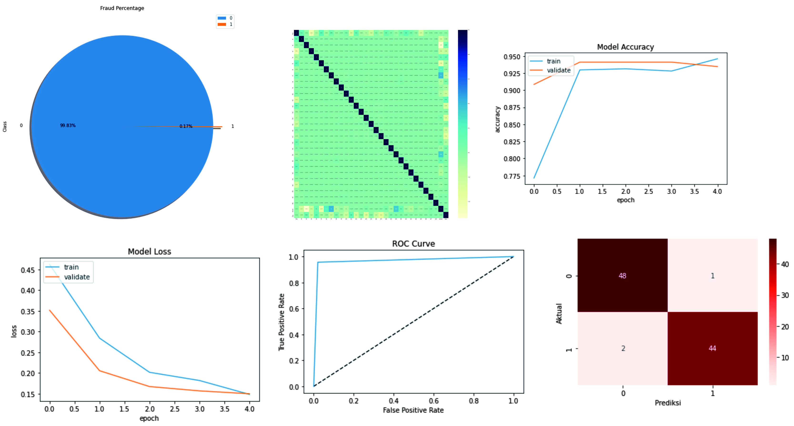

# Credit Card Fraud Detection

## Project Overview
The project to detect credit card fraud at a bank based on its important features so the company can give them special treatment. The dataset used in this project are obtained from MLB - ULB. I am performing comprehensive EDA on Credit Card Faud dataset to understand important variables, handled missing values, outliers and apply machine learning model. The model used for this project is neural networks.

## Framework Steps:
1. Data Preparation
2. Data Cleaning
3. EDA
4. Feature Scaling
5. Modeling
6. Evaluation

## Result

